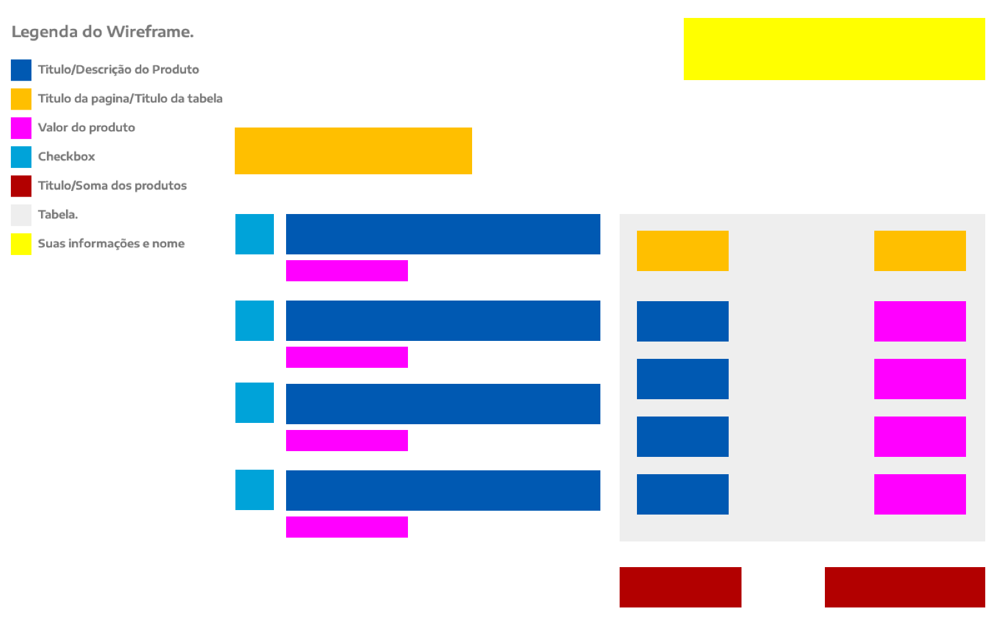

# Estágio - Full Stack

Venha fazer parte do setor de novos negócios da Organização Educacional Farias Brito. Aqui você trabalhará em um ambiente em constante evolução, onde terá a oportunidade de se desenvolver e crescer.

## Atividades

* Criação de Single Page Applications (SPA) com Bootstrap e React;
* Integração de SPA's com webservices;
* Criação de WebServices em NodeJS.

## Requisitos
* Cursando superior em áreas relacionadas a TI no Centro Universitário Farias Brito (Análise de Sistemas, Cinência da Computação, Sistemas de Informação e afins)
* Conhecer as seguintes tecnologias:
	* HTML
	* CSS
	* Javascript
	* Git

## Conhecimento desejável

* React
* Redux
* NodeJS
* Metodologias ágeis
* Testes

## Tecnologias/Padrões para o desafio
É altamente recomendado a utilização das seguintes tecnologias/padrões:

* HTML5
* CSS
* Bootstrap
* ReactJS, Vue, Angular (Opcional)
  

## Quais são as etapas para participar do processo?
* Implemente o desafio proposto no abaixo.
* Faça um push para seu repositório com o desafio implementado.
* Envie um email para (cleanderson.queiroz@fariasbrito.com.br) com a URL do repositório avisando que você concluiu o projeto.

## O Desafio:
Você deverá criar uma SPA (Single Page Aplication) que consuma a seguinte API: [Lista de Produtos](https://api.jsonbin.io/b/5f7f43567243cd7e824cec6f). A API apresenta uma listagem de produtos com seu id, descrição, valor e código correspondente.
A imagem abaixo mostra como deverá ser o layout implementado. Do lado esquerdo é apresentada uma listagem de produtos(que é obtida pela API). No lado direito deverá apresentar uma lista, que consiste na lista de produtos selecionados do lado esquerdo e ao final um totalizador contendo a somatória dos produtos selecionados. 

## Critérios de avaliação:
Entre os critérios de avaliação estão:

* Usabilidade.
* Criatividade.
* Organização do código.
* Performance do código.
* Documentação do código.
* Boas práticas de desenvolvimento.
* Arquitetura do projeto.
* Documentação do projeto (README)

## Restou alguma dúvida?
Você pode enviar um email para: cleanderson.queiroz@fariasbrito.com.br
